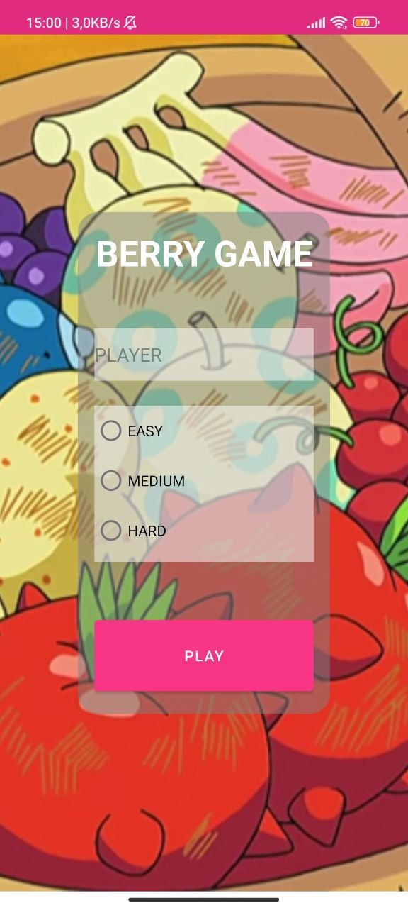
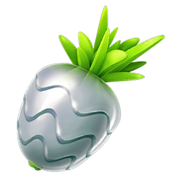
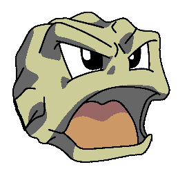
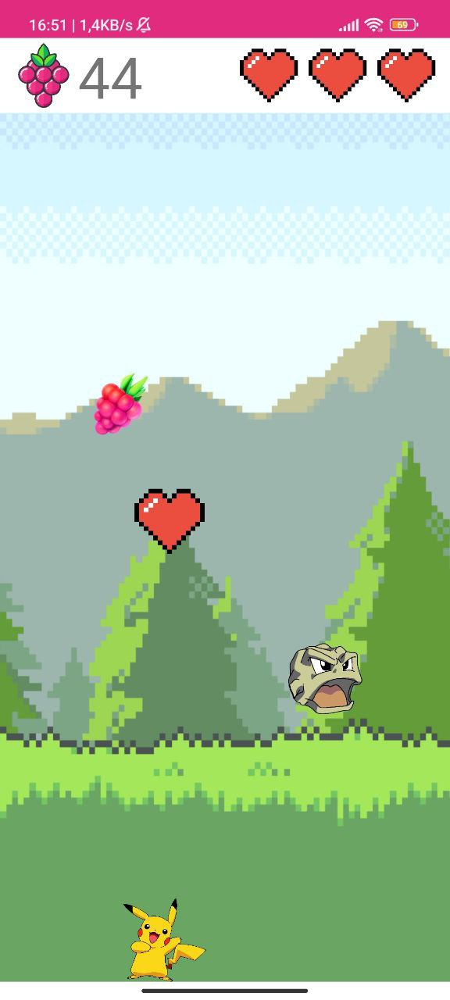

# Berry Game

Welcome to Berry Game! This is a simple and fun game where players collect berries and avoid obstacles. 
The game is built using [Android](https://www.android.com/).

## Table of Contents

- [Features](#features)
- [Getting Started](#getting-started)
- [Gameplay](#gameplay)
- [Contributing](#contributing)
- [License](#license)

## Features

- Collect berries to earn points. 

There are five types of berries in the game, each with its unique appearance and point value:
    1. **Razz Berry:** This common berry gives you **1 points**. 
    2. **Pinap Berry:** A slightly rarer berry that awards **2 points**. 
    3. **Nanap Berry:** A rare and delicious berry worth **3 points**. 
    4. **Silver Pinap Berry:** A very rare berry that grants you 5 points. 
    5. **Golden Razz Berry:** The ultra-rare, golden berry that yields a whopping 10 points. 

- Avoid rocks (Geodude) to stay alive.

## Getting Started

To play Berry Game on your local machine, follow these steps:

1. Clone this repository: `git clone https://github.com/enriqueseor/berry-game.git`
2. Open the project in Android Studio.
3. Select a virtual or physical device tu run the app
4. Build and Run the project.

## Gameplay

- Touch the screen to move your character.
- Collect as many berries as you can to earn points.
- There are five types of berries in the game, and each type gives you a different number of points. The rarer the berry, the more points it awards.
- Collect hearts to gain extra lives and extend your gameplay.
- Avoid colliding with obstacles, as they will reduce your health.
- The game ends when your health reaches zero.

- You have also a Results screen to see your punctuation and your player name.

## License

This project is licensed under the [MIT License](LICENSE).